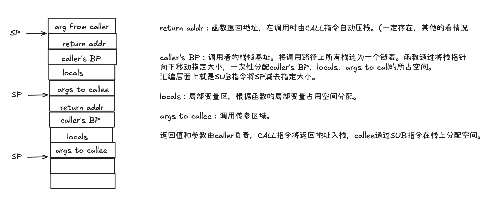
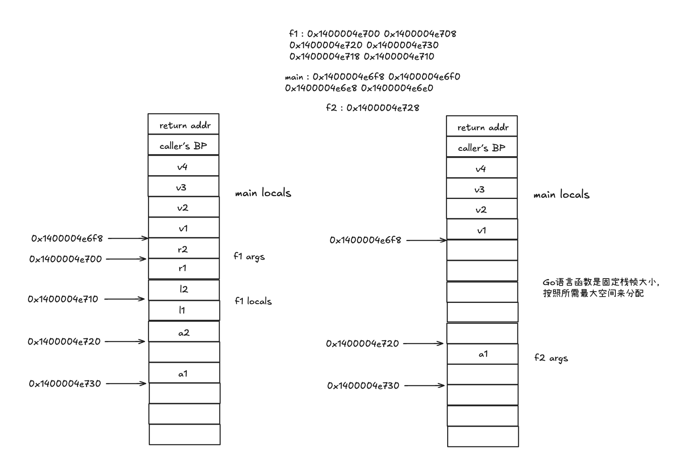

第三章 函数

从代码结构来看，层层函数调用就是一个后进先出的过程。与数据结构中的入栈出栈完全一致。这种调用方式称为递归调用。
所以非常适合用栈来管理函数的局部变量等数据。

汇编语言中，函数调用的过程是这样的：
调用函数时，先将参数压栈，然后跳转到函数的入口地址。函数执行完毕后，返回值放在寄存器中，然后将栈中的参数弹出，最后跳转回调用函数的地址。

用汇编代码来看，函数调用的过程是这样的：
```asm
push 参数1
push 参数2
call 函数地址
add esp, 8
```
意思为：将参数1和参数2压栈，然后调用函数，函数执行完毕后，将栈中的参数弹出。
函数返回的过程是这样的：
```asm
mov eax, 返回值
ret
```
这里的`ret`指令会将栈中的参数弹出，然后跳转回调用函数的地址。

3.1 栈帧

函数调用时，会在栈上分配一块内存，用来存放函数的局部变量、参数、返回地址等信息。这块内存称为栈帧。

3.1.1 栈帧的组成

栈帧布局在编译阶段确定。依据函数代码。




go代码如下：
```go
func main() {
var v1, v2 int
v3, v4 := f1(v1, v2)
println(&v1, &v2, &v3, &v4)
f2(v3)

}

func f1(a1, a2 int) (r1, r2 int) {
var l1, l2 int
println(&r2, &r1, &a2, &a1, &l1, &l2)
return
}

func f2(a1 int) {
println(&a1)
}
```
示例代码的输出如下：
```asm
f1：0x1400004e700 0x1400004e708 0x1400004e720 0x1400004e730 0x1400004e718 0x1400004e710
main：0x1400004e6f8 0x1400004e6f0 0x1400004e6e8 0x1400004e6e0
f2：0x1400004e728
```

在Go语言中，变量的地址分配与对齐方式有关。对于int类型的变量，通常是8字节对齐。这意味着每个int变量的地址必须是8的倍数。  在你的代码中，a1和a2是函数f1的参数，它们的地址分配可能会受到编译器优化和栈帧布局的影响。具体来说，编译器可能会在栈帧中插入额外的填充字节（padding）以满足对齐要求或其他优化目的。  在你的示例输出中，a2和a1之间相差16字节，而其他变量之间相差8字节，这可能是由于编译器在栈帧中插入了额外的填充字节，以确保后续变量的对齐或其他优化目的。



3.1.2 寻址方式

```go
func main(){
	fa(0)
}
func fa(n int)(r int){
	r = fb(n)
	return
}
func fb(n int)int{
	return n
}
```
3.1.3 又见内存对齐

C语言调用中，栈传递的参数需要对齐到平台的位宽。在64位系统中，参数需要对齐到8字节。在32位系统中，参数需要对齐到4字节。这样做是为了提高内存访问的效率。如果参数没有对齐，那么CPU可能需要多次访问内存才能读取完整的参数值。这会导致性能下降。
如果传递大量参数，那么参数对齐的开销可能会很大。这时，可以考虑将参数封装到一个结构体中，然后传递结构体的指针。这样，只需要传递一个指针，就可以访问所有参数。这样做可以减少参数对齐的开销，提高性能。

Go语言函数栈帧中返回值和参数的对齐方式与struct对齐方式类似。所有返回值和所有参数等价于两个struct。

可以做以下验证：
```go
type S struct {
    a int8
    b int64
    c int32
    d int16
}

func f1(s S)(r S){
    println(&r.a, &r.b, &r.c, &r.d, &s.a, &s.b, &s.c, &s.d)
    return s
}

func f2(aa int8, bb int64, cc int32, dd int16)(ra int8, rb int64, rc int32, rd int16){
    println(&ra, &rb, &rc, &rd, &aa, &bb, &cc, &dd)
    return
}

func main(){
    f1(S{})
    f2(0, 0, 0, 0)
}   
```

结果如下：
```shell
0x1400004e6c0 0x1400004e6c8 0x1400004e6d0 0x1400004e6d4 0x1400004e728 0x1400004e730 0x1400004e738 0x1400004e73c
0x1400004e6c9 0x1400004e6d0 0x1400004e6cc 0x1400004e6ca 0x1400004e728 0x1400004e730 0x1400004e738 0x1400004e73c
```

在Go语言中，变量的地址分配与内存对齐方式有关。内存对齐是为了提高内存访问的效率，编译器会根据变量的类型和对齐要求来分配内存地址。

在你的代码中，`f1`和`f2`函数的参数和返回值的地址分配如下：

1. **`f1`函数**：
    - `r.a` (int8) 地址：`0x1400004e6c0`
    - `r.b` (int64) 地址：`0x1400004e6c8`
    - `r.c` (int32) 地址：`0x1400004e6d0`
    - `r.d` (int16) 地址：`0x1400004e6d4`
    - `s.a` (int8) 地址：`0x1400004e728`
    - `s.b` (int64) 地址：`0x1400004e730`
    - `s.c` (int32) 地址：`0x1400004e738`
    - `s.d` (int16) 地址：`0x1400004e73c`

2. **`f2`函数**：
    - `ra` (int8) 地址：`0x1400004e6c9`
    - `rb` (int64) 地址：`0x1400004e6d0`
    - `rc` (int32) 地址：`0x1400004e6cc`
    - `rd` (int16) 地址：`0x1400004e6ca`
    - `aa` (int8) 地址：`0x1400004e728`
    - `bb` (int64) 地址：`0x1400004e730`
    - `cc` (int32) 地址：`0x1400004e738`
    - `dd` (int16) 地址：`0x1400004e73c`

**原因分析**：
- **对齐方式**：`int8`类型的变量对齐到1字节，`int64`类型的变量对齐到8字节，`int32`类型的变量对齐到4字节，`int16`类型的变量对齐到2字节。
- **内存填充**：为了满足对齐要求，编译器会在变量之间插入填充字节（padding）。例如，在`f2`函数中，`ra`的地址是`0x1400004e6c9`，而`rb`的地址是`0x1400004e6d0`，中间有填充字节以满足`int64`的对齐要求。

因此，`f1`和`f2`函数的变量地址分配结果不同，是由于编译器在分配内存时插入了填充字节以满足对齐要求。

3.1.4 调用约定

调用约定是指函数调用时，参数的传递方式、返回值的传递方式、栈的清理方式等规则。调用约定是由编译器和操作系统共同约定的。
1. 返回值和参数都通过栈传递。
2. 返回值和参数在栈上的布局等价于两个struct。

对于Go中的函数，先通过编译一个个函数文件，然后通过链接器将这些文件链接成一个可执行文件。在链接阶段，会将函数调用的地址填充到调用指令中。这样，当函数被调用时，CPU会跳转到函数的入口地址。
所以在使用go tool compile时，生成.o文件。这个文件会预留出一段空间，在链接时填写真正偏移值。

3.2 逃逸分析

3.2.1 什么是逃逸分析

如果函数将自己栈帧上的某个局部变量的地址，作为返回值返回，会出现什么问题？可能出现指针悬挂。
但是事实上，Go语言的编译器会对这种情况进行检查，如果发现函数返回的局部变量的地址，会将这个局部变量分配到堆上，而不是栈上。这个过程称为逃逸分析。

3.2.2 不逃逸分析

编译器倾向于不让变量逃逸。只要变量的生命周期没有超过当前函数栈帧生命周期，就不进行堆分配。

3.2.3 不逃逸判断

```go
func RetArg(p *int) *int {
    return p
}

func arg()int{
	var a int
	return *RetArg(&a)
}
```
虽然上述代码中看起来像是逃逸，但是实际上Go编译器会对这种情况进行优化，不会将局部变量`a`分配到堆上。这是因为`RetArg`函数返回的指针`p`只在`arg`函数中使用，不会逃逸到`arg`函数之外。因此，`a`变量不会逃逸，仍然分配在栈上。

而
```go
func RetArg(p *int) *int {
    return p
}
func retArg(p *int) *int
func arg()int{
    var a int
	var b int
    return *retArg(&a) + retArg(&b)
}
```

此时，a是栈分配，而b已经逃逸。因为retArg声明没有给出。所以编译器无法处理，或者说没有把握确信b有无逃逸，故一律按照逃逸处理。即使这样可能导致效率低一些。


