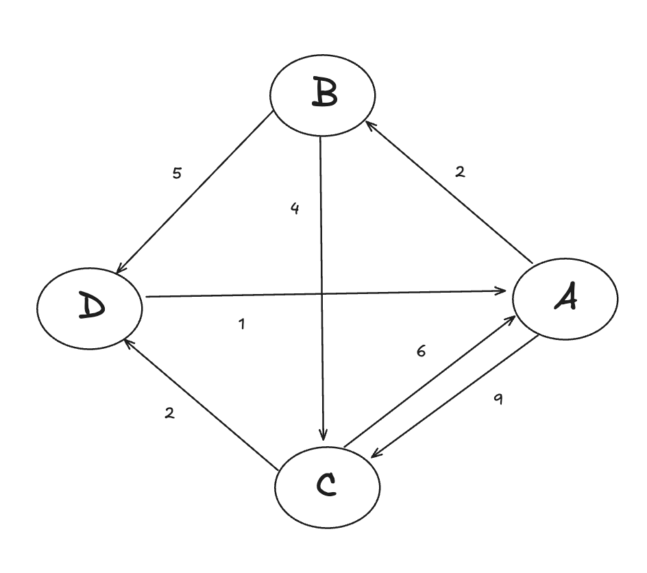

第四章 使用内置包

4.2 Dijkstra 路径查找算法

Dijkstra算法是一种贪心算法，用于计算图中的最短路径。它的基本思想是从起点开始，逐步扩展到其他节点，直到到达终点。在扩展的过程中，每次选择距离起点最近的节点，然后更新与该节点相邻的节点的距离。这样，直到所有节点都被访问过，就得到了起点到终点的最短路径。




对每个节点（结构体）的后驱节点进行遍历，然后计算开销。

先定义结构体

```go
type Node struct{
    Name string
    links []Edge
}

type Edge struct{
    from *Node
    to *Node
    cost int
}

type Graph struct{
    nodes map[string] *Node
}

```

还定义了一个辅助函数，创建一个新的图结构体实例。

```go
func NewGraph() *Graph{
    return &Graph{nodes:map[string]*Node{}}
}
```

需要先编写一些基础的结构，方便用户能够与实际的路径查找算法进行交互。这意味着必须能够获取图。

```go
func (g *Graph) AddNodes(names ...string){
    for _,name := range names{ //遍历所有的节点
        if _,ok := g.nodes[name];!ok{//如果没有这个节点
            g.nodes[name] = &Node{Name:name,links:[]Edghe{}}
            }
        }
}
```

```go
func (g *Graph)AddLink(a,b string,cost int){
	aNode := g.nodes[a]
	bNode := g.nodes[b]
	aNode.links = append(aNode.links,
		Edge{from:aNode,to:bNode,cost:uint(cost)})
}
```

前者用于添加没有连接的新节点，另一个用于向现有节点添加连接。

